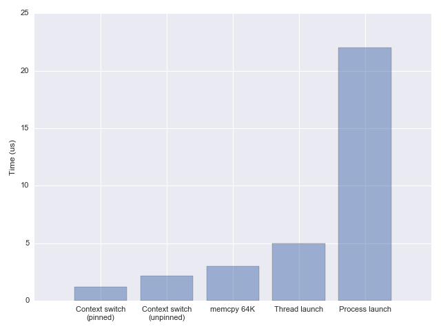

主要内容翻译自 [《Measuring context switching and memory overheads for Linux threads》](https://eli.thegreenplace.net/2018/measuring-context-switching-and-memory-overheads-for-linux-threads/)

## 在1次context switch中都发生了什么？

在Linux内核中，这个问题有两个重要的方面：
1. 何时发生一次内核切换？ 
2. 它如何发生？ 

这里主要讨论第二个问题。 

<!--more-->

假设内核已经决定切换到一个不同的用户线程，比如当前运行线程为了等待I/O陷入休眠。

一次context switch期间的第一件事是切换到内核态，无论是通过显式系统调用(比如`write` 到一些文件或管道)，或是一次定时器中断(当内核抢占一个时间片已经释放的用户线程)。这需要保存用户空间线程的寄存器，并跳转到内核代码。 

接着，调度器判断接着该运行哪个线程。当我们知道接着改运行哪个线程时，虚拟内存的重要记录需要注意；新线程的页表需要被加载到内存等等。

最后，内核回复新线程的寄存器和将控制权交回用户空间。 

## context switch 到底有多昂贵? 

每个线程都有一些内存的工作集，它们的部分或是所有会在cache中；当我们切换到另一个线程时，所有这些cache中的数据会变得不需要，且被缓慢刷出，被新线程的数据替换。两个线程之间频繁的切换会导致许多这样的颠簸。 

在接下来的测试基准中，并不测量间接开销，因为要避免任何形式的多任务(multi-tasking)确实很难。即使我们在相同线程内部在不同的异步事件handler之间"切换"，它们可能会有不同的内存工作集。并且如果这些工作集足够大，它们会干扰彼此的cache使用。 

这些[代码样例](https://github.com/eliben/code-for-blog/tree/master/2018/threadoverhead)使用两个不同的技术来测量context switch开销: 

1. 在两个线程间使用管道来ping-pong小量数据。对管道的每次`read`会阻塞读线程，接着内核会切换到写线程，然后这样循环往复。 
2. 两个线程间使用条件变量通知彼此。 

context switch时间还取决于一些额外因素；比如，在一个多核CPU上，内核会偶然地由于一个线程之前使用的核心被占用，从而在CPU核心之间迁移该线程。尽管这有助于利用多核心，这种切换会比在相同核心上切换开销更大(同样是因为缓存的原因)。基准测试能够通过运行将亲和性绑定到一个核心上的`taskset`限制线程在不同核心上的迁移。当要记得这只会模拟一个更低地界限。 

使用这两个技术得到了相似的结果：每个上下文切换大致在1.2~1.5us之间。这里测量的是直接开销，并且绑定到单个核心上避免迁移开销。如果没有绑定，切换时间到达约2.2us。这个数值基本与其它在网上找到的一些测试结果相一致(比如来自`lmbench`的`lat_ctx` )。 

## 这样的延迟在实际情况中意味着什么？ ## 

 

